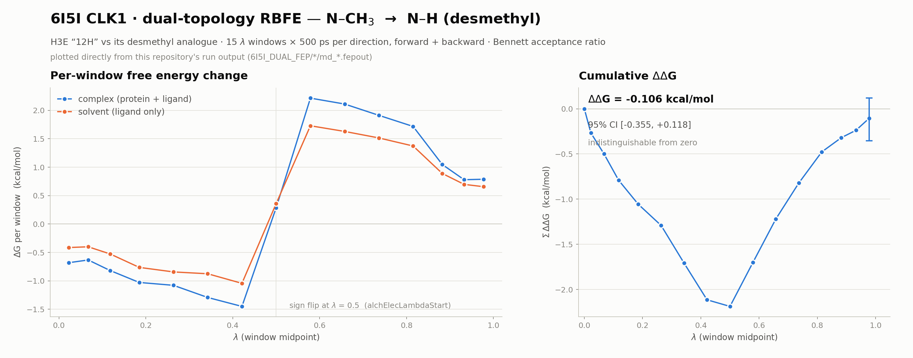

# Relative Binding Free Energy (RBFE) with NAMD

<picture>
  <source media="(prefers-color-scheme: dark)" srcset="docs/banner-dark.png">
  
</picture>

*Every number above is recomputed from this repository's own run output — the
per-λ-window `.fepout` files — by [`docs/plot_banner.py`](docs/plot_banner.py),
through the same extraction the quoted result uses. Re-run it and the figure
follows the data.*

A complete, **command-line** workflow for computing the relative binding free
energy (ΔΔG) of two similar ligands against the same protein target, using
NAMD's alchemical free-energy perturbation.

The goal is hit-to-lead ranking: FEP is far more accurate than docking, but it
costs more time and needs ligands with a common scaffold that can be mapped onto
each other.

Everything here runs locally: **no FEPrepare, no Maestro, no LigParGen web
server, no Jupyter notebook.** Three plain-Python preparation scripts, a
per-λ-window run driver, and two independent analysers.

**The general procedure is §1–§7** and works for any protein + ligand pair. It
is walked through end to end on a real system in
[§5, the worked example](#5-worked-example--6i5i-clk1).

> 中文版: [NAMD_RBFE_Guide_zh.md](NAMD_RBFE_Guide_zh.md) — the same workflow in
> Chinese, including notes on running this on Baidu AI Studio.

---

## What this computes

For two ligands **A** (reference) and **B** (mutant) binding the same protein:

```
ΔΔG_bind = ΔG_bind(B) − ΔG_bind(A)
```

Directly simulating binding is hopeless, so we use a **thermodynamic cycle** and
alchemically transmute A into B in two environments instead:

```
                ΔG_complex
   protein·A  ──────────────►  protein·B
       │                            │
       │ ΔG_bind(A)      ΔG_bind(B) │
       ▼                            ▼
       A      ──────────────►       B
                ΔG_solvent

   ΔΔG_bind = ΔG_complex − ΔG_solvent     (the two vertical legs cancel)
```

Only the two horizontal legs are simulated. Each becomes a sequence of λ windows
in which the A-only atoms are switched off while the B-only atoms switch on.

<p align="center">
  
  
</p>

### Dual topology

NAMD's default scheme (`singleTopology off`) keeps **both** ligands present in
one system. Atoms identical between A and B appear **once** (the common core);
atoms that differ appear **twice** and are switched on/off. Which is which is
encoded in the `alchFile` **B-factor** column:

| B-factor | role | behaviour |
|---------:|------|-----------|
| **−1** | A-only (e.g. a methyl group) | **vanishes** as λ → 1 |
| **0** | common core — and the entire environment (protein, water, ions) | always on |
| **+1** | B-only (e.g. the H that replaces the methyl) | **appears** as λ → 1 |

This is the single most important convention in the repository. If the B-factors
are wrong, NAMD will run happily and hand you a meaningless number.

### The λ schedule

16 λ values → **15 windows**, denser near the endpoints where dE/dλ varies
fastest (`6I5I_DUAL_FEP/fep.tcl`):

```
0.0  0.045  0.09  0.14546  0.22425  0.30303  0.38182  0.46061
0.53939  0.61818  0.69697  0.77575  0.85454  0.91  0.955  1.0
```

Each window is 250 000 steps at 2 fs = **500 ps**, so one direction of one leg is
15 × 500 ps = **7.5 ns**. Every leg is run **forward and backward**, which gives
the hysteresis check and the pair of directions BAR needs.

---

## Repository layout

```
NAMD-FEP/
├── README.md                  ← you are here — the general workflow
├── NAMD_RBFE_Guide_zh.md      Chinese companion guide
├── LICENSE                    MIT
├── toppar/                    CHARMM36 parameters (only the 7 files actually read)
├── docs/
│   ├── plot_banner.py         renders the banner above from the run output
│   └── banner-{light,dark}.png
└── 6I5I_DUAL_FEP/             the worked example — see §5
    ├── inputs/                protein.pdb + ref/mut ligand (mol2, pdb, rtf, prm)
    ├── prepare_hybrid.py      ① build the dual-topology hybrid ligand
    ├── build_system.py        ② psfgen → solvate → ionize (complex + solvent)
    ├── write_fep_inputs.py    ③ ionized.fep + fep.tcl + the .namd configs
    ├── fep_run.py             per-λ-window NAMD driver (idempotent)
    ├── run_checkpointed.sh    crash-safe controller — **the way to run**
    ├── respawn_controller.sh  relaunches the controller after a node kill
    ├── watch_windows.sh       snapshots a clean restart at every window boundary
    ├── checkpoint_status.sh   read-only watchdog (where did it stop?)
    ├── run_all.sh             original one-shot launcher (fresh runs only)
    ├── analyze_fep.py         EXP / BAR estimators
    ├── audit_fep.py           independent audit + error bars — **what to trust**
    ├── fep.tcl                runFEP / runFEPmin procs + the λ schedule
    ├── complex/  solvent/     generated systems, configs, results
    ├── DDG_preliminary.md     theory + process notes for the example
    └── README.md              example-specific detail
```

---

## 0. Prerequisites

| need | why | check |
|---|---|---|
| **NAMD 3.x, GPU-resident build** | 20×+ faster than the plain CUDA build; the configs assume it | `"$NAMD" --version` |
| **VMD with psfgen** | step ② builds the PSF/PDB | `"$VMD" -dispdev text -e /dev/null` |
| **Python 3.8+** with `numpy` | prep scripts + analysers | `python3 -c "import numpy"` |
| **CHARMM36 toppar** | `toppar/` ships the 7 files the workflow reads | `ls toppar/` |
| a GPU | obviously | `nvidia-smi` |

Export the two binaries once per session — both `build_system.py` and
`fep_run.py` read these, and fall back to the paths baked in on the original
box if they are unset:

```bash
export NAMD=/path/to/Linux-x86_64-g++.gpuresident/namd3   # GPU-resident build
export VMD=/path/to/vmd
```

> If you built NAMD yourself, note that `GPUresident`/`CUDASOAintegrate` only
> exists in a build configured with `--with-single-node-cuda`. A plain
> `--with-cuda` build dies with *"GPUresident not supported on regular
> multicore builds"*. See the repository's GPU notes in §9.

### The one flag that matters most: `+p1`

In **GPU-resident** mode nearly all work happens on the GPU, so extra CPU threads
only add synchronisation contention. Throughput is *inversely* proportional to
the PE count. Measured on a 64 651-atom complex:

| threads | ns/day |
|---|---:|
| **`+p1`** | **75.8** ← use this |
| `+p2` | 59.5 |
| `+p4` | 27.2 |
| `+p8` | 13.2 |
| `+p16` | 6.3 |

`+p8` (the correct habit for a *non*-GPU-resident build) costs **5.7×**.
Counter-intuitive but reproducible: **one PE, one GPU.**

### Paths to check on your own machine

```bash
grep -rn "/home/aistudio" 6I5I_DUAL_FEP/*.py 6I5I_DUAL_FEP/*.sh
```

| file | what |
|---|---|
| `fep_run.py` | `NAMD` — honours `$NAMD`, else the baked-in path |
| `build_system.py` | `VMD`, `NAMD` — honour `$VMD` / `$NAMD` |
| `run_all.sh` | the `namd3` path |

---

## 1. The general workflow

Five steps. Steps ②–④ are **the same three commands for any system**; what
changes between projects is the content of `inputs/`, the mapping logic in
`prepare_hybrid.py`, and the binary paths.

```
 inputs/                 hybrid/            complex/  solvent/         results
 protein.pdb  ─┐
 ref.{pdb,rtf,prm} ─┤─①─► hybrid.{pdb,rtf,prm} ─②─► ionized.{psf,pdb,fep}
 mut.{pdb,rtf,prm} ─┘                                + *.namd   ─③─► run ─④─► analyze ─⑤─► ΔΔG
```

### Step ① — assemble the inputs

You need:

1. **`protein.pdb`** — your protein. Chain breaks are fine.
   *Hydrogens are optional*: psfgen is fed `segment { pdb … }` + `guesscoord`
   and adds them itself. (The published 6I5I result was produced from a
   `protein.pdb` containing **zero** hydrogens.)
2. **A reference ligand and a mutant ligand**, each **all-atom**.
3. **CHARMM topology + parameters for each ligand** — `.rtf` + `.prm`.

Ligand hydrogens *are* required; all-atom input is a contract term of this
workflow.

Getting ligand parameters (either works — both yield CHARMM `.rtf`/`.prm`):

```bash
# Option A — acpype (bundled AmberTools, runs offline)
acpype -i ref.mol2 -c bcc -n 0 -b ref

# Option B — CGenFF via LigParGen / ParamChem, then convert to CHARMM
#            https://zarbi.chem.yale.edu/ligpargen/
```

> ⚠️ acpype writes **`IMPH`**, not `IMPR`, for impropers. If you hand-edit the
> `.rtf`, keep that spelling or psfgen will not apply the improper.

### Step ② — build the hybrid ligand

```bash
cd <your_system>
python3 prepare_hybrid.py
```

Reads `inputs/ref.{pdb,rtf,prm}` and `inputs/mut.{pdb,rtf,prm}`; writes
`hybrid/hybrid.{pdb,rtf,prm}` — a single ligand holding the common core **once**,
the A-only atoms, and the B-only atoms, with the B-factor column already marked
−1 / 0 / +1.

The reference implementation identifies the differing atoms by **local chemical
environment** rather than graph isomorphism, because graph matching fails on
symmetric rings — which is exactly the situation in the worked example. The
B-only hydrogen is then placed by a rigid alignment in the local nitrogen frame
(N–H = 1.01 Å).

**Always inspect `hybrid/hybrid.pdb` afterwards** in VMD: the common core once,
both differing groups present, and the B-factor column reading −1 / 0 / +1 where
you expect.

### Step ③ — build the two systems

```bash
python3 build_system.py
```

VMD/psfgen produces, for both legs:

| | `complex/` | `solvent/` |
|---|---|---|
| contents | protein (split at chain breaks) + hybrid ligand | hybrid ligand only |
| then | solvate + add ions | solvate + add ions |
| gives | `ionized.psf`, `ionized.pdb` | same |

### Step ④ — write the FEP inputs

```bash
python3 write_fep_inputs.py
```

Per leg this writes:

- `ionized.fep` — the solvated PDB with the `alchFile` B-factor column set
  (ligand −1/0/+1, environment 0)
- `nvt_equil.namd`, `npt_equil.namd`, `md_forward.namd`, `md_backward.namd`
- `../fep.tcl`, sourced by every config

> The `.namd` stages **chain their velocities**: `npt_equil`, `md_forward` and
> `md_backward` read the previous stage's `binvelocities`. Only `nvt_equil` sets
> `temperature` (it seeds with `reinitvels`). Setting `temperature` in a chained
> stage is fatal: *"Cannot specify both an initial temperature and a velocity
> file."*

---

## 2. Sanity-check before burning GPU time

```bash
cd complex
"$NAMD" +p1 +devices 0 --dryrun nvt_equil.namd       # parses configs, no dynamics
```

Then a short real run to confirm it moves and to measure the rate:

```bash
"$NAMD" +p1 +devices 0 nvt_equil.namd 2>&1 | tee /tmp/nvt.log
grep -E "^TIMING:" /tmp/nvt.log | tail -3      # sec/step -> ns/day
```

> **Do not judge speed from the `PERFORMANCE:` line.** It is a cumulative
> average from step 0, so the leading `minimize` drags it down for a long time —
> it will read ~3.9 ns/day while the true instantaneous rate is ~50 ns/day. Use
> `TIMING:` sec/step.

---

## 3. Running the production job

Each leg runs `nvt_equil → npt_equil → md_forward → md_backward`, **strictly
sequentially**. Never split one GPU between two NAMD jobs.

### Recommended — the crash-safe controller

```bash
cd 6I5I_DUAL_FEP
nohup bash respawn_controller.sh > controller_run.log 2>&1 &
echo $! > controller_run.pid
```

`respawn_controller.sh` wraps `run_checkpointed.sh`, which is **marker-guarded**
and idempotent. It runs **one NAMD invocation per λ window** through `fep_run.py`
and drops a `.md_forward_w07.done` marker as each window finishes, so an
interruption resumes at the interrupted window. The controller relaunches it
automatically after the node kills the job and exits when it sees
`ALL LEGS DONE`.

Why this exists: **a single NAMD process running all 15 windows forgets which λ
it was on when it dies**, so the whole direction replays from λ = 0. That is the
entire reason `fep_run.py` drives one window per process.

```bash
tail -f controller_run.log
python3 fep_run.py windows complex md_forward     # per-window probe
bash checkpoint_status.sh 60                      # read-only watchdog
```

### Alternative — the one-shot launcher

```bash
bash run_all.sh        # FRESH runs only
```

It refuses to start when production state already exists, because it replays from
`nvt_equil` and is not crash-safe. Never use it to resume.

### Expected wall-clock

Measured on one V100 (64 651-atom complex / 5 013-atom solvent):

| | rate | per leg |
|---|---:|---:|
| complex | **47 ns/day** | ~7.7 h |
| solvent | **59 ns/day** | ~6.2 h |
| **full job (both legs)** | | **~14–16 h** |

The solvent leg is 13× smaller but only 1.25× faster: at this size the V100 is
latency-bound, not throughput-bound. GPU memory is not the constraint — NAMD
peaks at ~590 MiB on this system.

---

## 4. Analysis

Two independent analysers. **Use `audit_fep.py`.**

### `audit_fep.py` — the one to trust

```bash
cd 6I5I_DUAL_FEP
python3 audit_fep.py                 # full audit + bootstrap error bars
python3 audit_fep.py --skip-boot     # fast, no error bars
python3 audit_fep.py --scan          # ΔΔG sensitivity to the equilibration trim
python3 audit_fep.py --trim 150      # force a specific trim
```

It reads the **per-window** `.fepout` files — never the assembled ones, because
assembly strips the comment lines it needs — and does two things a naive
analysis does not:

1. **Discards the per-window equilibration samples.** With `alchEquilSteps
   50000` at 2 fs = 100 ps and `alchOutFreq 500` = 1 ps, the first **99 of every
   500 rows** are equilibration. NAMD's own accumulator resets at
   `stepInRun == alchEquilSteps`, so its `dE_avg`/`dG` columns already use only
   the 401 production rows; averaging all 500 biases the result.
2. **Validates the extraction chain against NAMD's own output**, recomputing
   one-sided EXP per window from the raw `dE` column and comparing against
   NAMD's `#Free energy change for lambda window […] is <dG>` comment. Over all
   30 forward windows they agree to **7 × 10⁻⁶ kcal/mol**.

It also reports hysteresis, first-half-vs-second-half stationarity, σ(dE)/kT
overlap, and a moving-block bootstrap error on ΔΔG.

### `analyze_fep.py` — quick estimators

```bash
# one-sided Zwanzig — biased, but useful as a preview while the backward leg runs
python3 analyze_fep.py exp complex/md_forward_combined.fepout \
                           solvent/md_forward_combined.fepout

# two-state BAR per window from forward/backward pairs — the final estimator
python3 analyze_fep.py bar complex/md_forward_combined.fepout \
                           complex/md_backward_combined.fepout \
                           solvent/md_forward_combined.fepout \
                           solvent/md_backward_combined.fepout
```

Reads NAMD's raw `FepEnergy` rows directly. `--json` gives machine-readable
output.

> ⚠️ `dE` is `U(λ+dλ) − U(λ)`, so a **backward** file pairs to window *i* by
> **reversed index**, and its dE must be negated — a backward run samples state B
> and reports `U(A) − U(B)`.

---

## 5. Worked example — 6I5I CLK1

**System**: PDB **6I5I**, CLK1 kinase, ligand **H3E ("12H")**. The reference
ligand carries an **N–CH₃** on a pyrazole nitrogen; the mutant is the
**desmethyl** analogue with an **N–H** in its place.

```
  ref:  …–N(CH₃)–…                    mut:  …–N(H)–…
        methyl C12 + H7/H8/H9                H17
        B-factor = −1                        B-factor = +1
```

Two ligands differing by one methyl ↔ hydrogen is the ideal RBFE case — and a
deliberately hard one, because the change alters the **charge** on the ring
nitrogen rather than just the shape.

### The commands, in order

```bash
cd 6I5I_DUAL_FEP

# ① inputs are already present: inputs/{protein.pdb, ref.*, mut.*}
#    protein.pdb is chain A with a disordered gap 412→416 (split into P1/P2 by
#    build_system.py); it contains no hydrogens — psfgen adds them.

# ② hybrid ligand
python3 prepare_hybrid.py          # -> hybrid/hybrid.{pdb,rtf,prm}

# ③ build both systems (needs VMD)
python3 build_system.py            # -> complex/ + solvent/

# ④ FEP inputs
python3 write_fep_inputs.py        # -> ionized.fep, fep.tcl, *.namd

# ⑤ run — crash-safe, ~14-16 h on one V100
nohup bash respawn_controller.sh > controller_run.log 2>&1 &
echo $! > controller_run.pid

# ⑥ analyse
python3 audit_fep.py
```

### The result

```
dG_complex = +3.882 kcal/mol
dG_solvent = +3.988 kcal/mol
─────────────────────────────────
ΔΔG_bind   = −0.106 kcal/mol
95% CI (moving-block bootstrap) = [−0.355, +0.118]
```

**The honest reading: this is zero.** The confidence interval comfortably
contains 0, so this calculation does *not* resolve a binding difference between
the methylated and desmethyl ligands. That is a legitimate result — and for a
single methyl → H perturbation with only 500 ps per window, it is the expected
one.

### Why the number is fragile (read before quoting it)

1. **It is a near-cancellation of two ~2.3 kcal/mol halves that flip sign at
   λ ≈ 0.5.** Σ per-window ΔΔG ≈ −2.37 (λ < 0.5) + 2.26 (λ > 0.5). λ = 0.5 is
   exactly `alchElecLambdaStart` — where the methyl's charge finishes vanishing
   and the N–H's begins appearing. The cancellation is structural, not a bug.
2. **The complex leg is not stationary.** Σ[second half − first half] = **+0.365**
   kcal/mol (solvent: −0.007). The largest single window contributes +0.258. It is
   still drifting across the 500 ps window — i.e. under-equilibrated.
3. **The answer moves ±0.1 kcal/mol with the trim alone**: −0.057 (trim 0),
   −0.141 (trim 150), +0.067 (trim 300). That systematic is the same size as the
   statistical error.
4. **The backward leg restarts from `npt_equil.coor` at λ = 1.0**, not from
   forward window 14's endpoint — so its environment is equilibrated around the
   *methylated* ligand while being sampled at the *desmethyl* state. Cheap fix:
   seed it from `md_forward_w14`.
5. **15 × 500 ps = 7.5 ns per leg is short.** 2–5 ns per window is typical for
   production RBFE.

### What to do differently next time

- Lengthen the windows (2–5 ns) — the single biggest lever.
- Seed the backward leg from the forward endpoint (item 4 above).
- Add windows around λ = 0.5, where the two halves trade places.
- Run ≥ 3 independent replicates and report the spread; one 7.5 ns leg cannot
  support a sub-kcal/mol claim.

Full theory and process notes:
[6I5I_DUAL_FEP/DDG_preliminary.md](6I5I_DUAL_FEP/DDG_preliminary.md).

---

## 6. Adapting this to your own system

```bash
cp -r 6I5I_DUAL_FEP/ my_system/ && cd my_system
rm -rf complex solvent hybrid                    # drop the generated state
cp /path/to/protein.pdb              inputs/protein.pdb
cp /path/to/ref.{mol2,pdb,rtf,prm}   inputs/
cp /path/to/mut.{mol2,pdb,rtf,prm}   inputs/
```

Then edit, in this order:

| where | what |
|---|---|
| `prepare_hybrid.py` | the atom-identification logic for **your** chemical difference — the only genuinely system-specific code |
| `build_system.py` | your protein's chain breaks, the water-box padding, the salt concentration |
| `write_fep_inputs.py` | the toppar list (~line 24) and, if you want a different schedule, the λ values |
| `fep.tcl` | the λ schedule |
| `fep_run.py`, `run_all.sh` | `$NAMD` / the `namd3` path |

Then re-run ② → ③ → ④, and **check the B-factors in `hybrid/hybrid.pdb`** before
starting anything long.

---

## 7. Traps that have already bitten

Every one of these produced a wrong number or a wasted run at least once.

**Physics and setup**

- **The B-factor column is the whole ballgame.** −1 vanishes, +1 appears, 0
  stays. Verify it visually; do not trust the script.
- **`alchDecouple off`, `alchElecLambdaStart 0.5`, `alchVdwLambdaEnd 1.0` are
  NAMD defaults** — nobody tuned them. Understand them before changing them.
- **`runFEP <l0> <l1> <dl>` with `dl = 0` divides by zero.** Guard it.
- **Water/ions parameters: use `par_water_ions_clean.prm`.** NAMD cannot parse
  the `toppar_water_ions.str` stream file directly.

**Restart chaining**

- **A restart-chained stage must not set `temperature`** (§1, step ④).
- **`GPUresident` must appear in exactly one place** — in the config *or* on the
  command line, never both, or NAMD dies with *"Multiple definitions of
  'GPUresident'"*.

**Running**

- **Use `+p1`** — `+p8` costs 5.7× (§0).
- **`+devices 0` is two argv tokens.** As one string it is unparseable by the
  Charm++ RTS and NAMD dies with *"Unknown command-line option +devices 0"*.
  A shell word-splits; a Python list does not.
- **Never run all 15 windows in one NAMD process** if you want crash resilience
  (§3).
- **`Disabling lonepair support due to incompatability with GPU-resident`** is
  harmless *only* if your PSF has no lone pairs. Check `NUMLP` if your ligand
  uses CGenFF halogen lone pairs.

**Analysis**

- **The first 99 of every 500 rows are equilibration, not production** (§4).
- **NAMD writes only ONE `#NEW FEP WINDOW` line per process** — windows are
  delimited by step buckets of 250 000, not by that comment.
- **A backward `.fepout` pairs to window *i* by reversed index, and its `dE`
  must be negated** (§4).

---

## 8. Performance reference

Measured on the 6I5I systems at `+p1` with the GPU-resident build:

| system | atoms | rate | sec/step |
|---|---:|---:|---:|
| complex | 64 651 | **47 ns/day** | 0.00367 |
| solvent | 5 013 | **59 ns/day** | 0.00293 |

Against the originally recorded baseline (~1.7 ns/day):

| | old build `+p8` | GPU-resident `+p8` | GPU-resident `+p1` |
|---|---:|---:|---:|
| plain MD | 3.57 | 14.08 | **75.79** |
| FEP (1 window) | 2.26 | 8.73 | **49.65** |

Accuracy is not traded away: a single-point energy on identical coordinates
agrees to ~8 significant figures between builds (relative difference 4 × 10⁻⁸,
i.e. float32 rounding). Output frequency is not a bottleneck — everything at 500
measured identically to 5000.

---

## 9. Heritage and references

This repository began as a Jupyter-notebook tutorial built on the NAMD
alchemical FEP tutorial and the FEPrepare web server. It has since been rewritten
as a fully local, command-line workflow; the notebook version is in the git
history.

- NAMD alchemical FEP tutorial — <http://www.ks.uiuc.edu/Training/Tutorials/>
- FEPrepare web server — *J. Chem. Inf. Model.* **2021**, 61, 4131–4138,
  <https://pubs.acs.org/doi/10.1021/acs.jcim.1c00215>
- The relative binding affinity cycle (not NAMD-specific; the thermodynamics are
  identical) — <http://www.alchemistry.org/wiki/Example:_Relative_Binding_Affinity>
- CHARMM36 force field — <https://mackerell.umaryland.edu/charmm_ff.shtml>
- Building NAMD with a working `GPUresident` (`--with-single-node-cuda`) —
  see the git history of this repo for the full recipe

## License

MIT — see [LICENSE](LICENSE).
